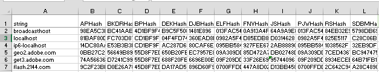
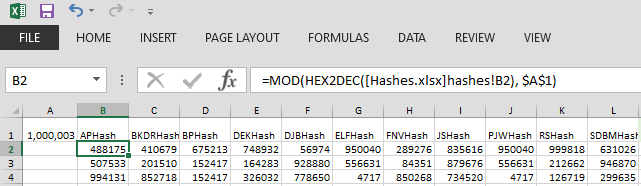
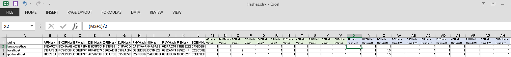
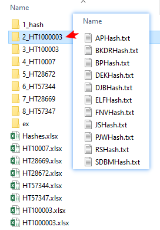
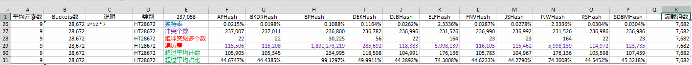
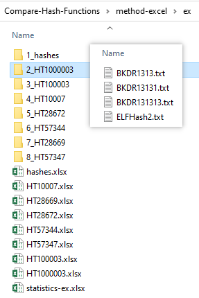
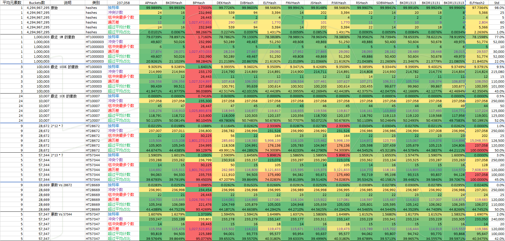

# 实例：比较优选字符串 HashTable 的 Hash 函数

## 背景

Hash，是摘要**特征值**，用于替代繁长的原始数据，期望尽量独特，但是难免会有 collisions。

[HashTable](https://en.wikipedia.org/wiki/Hash_table)，是把大量的 Hash 值，分类到更短的序数化队列，加速检索的组织方式；一维转二维，像图书馆的分类上架，分类内元素量少更好管理；一个类别内再比较是要原始数据完全匹配的，元素可以无序，也可以有相同 Hash 值。

这是 [改进 dnsforwarder 的 HashTable](https://github.com/lifenjoiner/dnsforwarder/commit/4a3c8b2ca65098ead5e378ebd23f01ef6c0550e9) 时所做的工作。网上能够检索到的 Hash 算法比较，有具体数据、实例性质的很少。公布出来，希望对有疑问者有帮助。毕竟，一个 Hash 函数，计算大量可变的输入数据之后的结果到底怎样，没有具体数据，很难靠想象评价。

## 准备

首先，准备工作，收集一些 Hash 函数。这里是 c 语言的。

[GeneralHashFunctions](https://github.com/lifenjoiner/Compare-Hash-Functions/tree/main/hash-tools/GeneralHashFunctions) 下11个：
```c
APHash
BKDRHash
BPHash
DEKHash
DJBHash
ELFHash
FNVHash
JSHash
PJWHash
RSHash
SDBMHash
```

[Hashes-Ex.c](https://github.com/lifenjoiner/Compare-Hash-Functions/tree/main/hash-tools/Hashes-Ex.c) 内额外4个变形：
```c
BKDR1313
BKDR13131
BKDR131313
ELFHash2
```

第二步，编写计算 Hash 的工具：[Hashes](https://github.com/lifenjoiner/Compare-Hash-Functions/tree/main/hash-tools/Hashes.c) 和 [Hashes-Ex](https://github.com/lifenjoiner/Compare-Hash-Functions/tree/main/hash-tools/Hashes-Ex.c)（后来拓展的，也可合并为一个）。编译，这里用的`tcc`：
```
tcc -I GeneralHashFunctions Hashes.c GeneralHashFunctions\GeneralHashFunctions.c
tcc Hashes-Ex.c
```
编译好的：[下载](https://github.com/lifenjoiner/Compare-Hash-Functions/releases/download/v0.0.9/hash-tools_win32_bin.7z)。

第三步，准备样品数据。
这里是一些常用 Host 文件合集。用 Excel 即可：筛选删除注释，分列保留 host，再去重得到规整的清单。237058条。保存为 [data/DNS-fw-hosts.txt](https://github.com/lifenjoiner/Compare-Hash-Functions/blob/main/data/DNS-fw-hosts.txt)。

第四步，计算 Hashes。
创建`data\hashes`目录，在`hash-tools`目录，运行：
```
Hashes.exe ..\data\DNS-fw-hosts.txt >..\data\hashes\DNS-fw-hosts-hashes.txt
Hashes-Ex.exe ..\data\DNS-fw-hosts.txt >..\data\hashes\DNS-fw-hosts-hashes-ex.txt
```

数据文件：[下载](https://github.com/lifenjoiner/Compare-Hash-Functions/releases/download/v0.0.9/hashes.7z)。

## 比较方案

比什么？最直接的，比较全部遍历 HashTable 元素的总操作次数。

以下包含，从直觉到调用专业统计工具，两种方案。

### 方案一：跟着直觉走，用 Excel，也探索一下需要设定什么评价指标。

这是普通用户即可获得的工具，写几个通用公式，拖拽填充一下，就能处理不少数据：

1. 创建文件夹`method-excel`。

2. 把`data\hashes\DNS-fw-hosts-hashes.txt`导入 Excel 文件，保存为`method-excel\Hashes.xlsx`。注意：要设定第二列往后的所有 Hash 列格式为文本，避免个别`mEn`格式的被识别为科学计数。

    

3. 构建 HashTable 的数据排布。即用 HashTable 的大小，取余数，索引化。用 Bucket 代指。

    这里选定了这些大小：0xFFFFFFFF, 1000003, 100003, 10007, 28672, 57344, 28669, 57347。

    0xFFFFFFFF 时, 相当于衡量 Hash 函数本身的结果特异性，不需要取余；其它的取余类似，以 1000003 为例。参考 `method-excel\HT1000003.xlsx`的 A:L 列。单元格 A1 为 HashTable 的大小；B2 的公式为：`=MOD(HEX2DEC([Hashes.xlsx]hashes!B2), $A$1)`，向右填充到 L2，B2:L2 向下填充到237058+1行。

    

4. 计算总操作次数。

    这里增加了两个辅助区块：M:W 和 X:AH。

    M1，`APHash Count`表示每个 Bucket 内的元素个数。M2 输入公式 `=CountIf(B$2:B$237059, B2)`，填充到 M2:W237059 可得全部。但是，这里会暴露出 *Excel 的第一个不足*：处理巨量数据时的性能不足，填充一列，计算完成就要高负荷运算几十分钟。
    于是，做了辅助工具 [countif.js](https://github.com/lifenjoiner/Compare-Hash-Functions/blob/main/countif.js)，提高速度。用法：把 B 列保存为`method-excel\2_HT1000003\APHash.txt`，运行`cscript countif.js method-excel\2_HT1000003\APHash.txt`，1秒钟得结果，再把计数结果贴到 M 列对应的位置。
    其它列，类似。

    X1，`APHash Rounds/N`表示每个元素需要的平均操作次数，用于计算总操作次数。X2，公式`=(M2+1)/2`，填充到 X2:X237059 得全部，再将 X3:X237059 复制粘贴只保留值，减少公式自动更新也减小文件大小。

    

    将所有选定 HashTable 大小的情形都耐心地计算出来，分别保存在不同的文件。

    如果，保存在同一个文件的不同 Sheet 里，你会发现 *Excel 的第二个不足*：大文件保存缓慢。前面的操作，数据量在、次数多，需要及时保存，防止卡死也便于分次完成。但是，当文件 xlsx 大于 100M 的时候，内部的 xml 文件会超过 1G，存取很慢，频繁地保存就是频繁地工作在极限状态，其在这方面没有优化，不是专业的数据库。

    这一步是最耗时的，又相似容易混淆，分次完成即可。难处已经被化解开了。最终，可得到如下的[数据文件](https://github.com/lifenjoiner/Compare-Hash-Functions/releases/download/v0.0.9/method-excel.7z)。

    

5. 统计评估。公式和数据，参考 `method-excel.7z` 内 `statistics.xlsx` 文件。

    

    平均元素数：总元素数/Bucket数，进位取整。

    独特率：Hash 唯一的比率。

    冲突个数：Hash 不唯一的个数。

    组冲突最多个数：最多元素数 Bucket 的元素数。沿用 0xFFFFFFFF 时的叫法，其它的不一定是 Hash 相同。

    满载组数：理想（平均）分布时，满载的 Bucket 的个数。用于计算理想状态下的总操作次数。

    遍历差：实际总操作次数 - 理想状态下的总操作次数。

    超过平均计数：实际分布中多于平均元素数的 Bucket 包含的元素数。

    超过平均占比：超过平均计数/总元素数。

到这里，方案已经走通了。

把拓展的`data\hashes\DNS-fw-hosts-hashes-ex.txt`用相同的方法处理。保存在 `method-excel\ex`下。[数据下载](https://github.com/lifenjoiner/Compare-Hash-Functions/releases/download/v0.0.9/method-excel-ex.7z)。



最后，再做个直观化展示。

把 `statistics.xlsx` 和 `statistics-ex.xlsx` 的值复制到新文件，格式化。
参考`method-excel.7z` 内 `StringHashTableCompare-PrettyReport.xlsx`。
技巧是：把`3-Color Scale`条件格式化的 Midpoint 设置成单元格的值（U 列），方便动态调整。

得如下图：



颜色越偏向红色越差，越偏向绿色越好。

BPHash 最差首先排除；再排除 ELFHash2；然后排除 ELFHash 和 PJWHash；最后排除 DEKHash，剩下的基本在同一水平。

这里有一个奇异的现象：ELFHash 和 PJWHash 的数据竟然是一样的！检查对应的 Hash，加一列公式比较可知完全一样。`Hashes`程序也并没有写错。这两个算法的结果是一样的！

### 方案二：使用专业数据处理统计工具。也校验一下方案一是否有算错。

这里用 python 调用`pandas`库，写了 [hashtable-cmp.py](hashtable-cmp.py)。
```
usage: hashtable-cmp <hashes-file> [write-intermediate-data]
```

处理 `data\hashes\DNS-fw-hosts-hashes.txt` 和 `data\hashes\DNS-fw-hosts-hashes-ex.txt`，得对应的 csv 文件，移动到文件夹`method-pandas`，合并得文件 `method-pandas\DNS-fw-hosts-hashes.statistics.xlsx`。按 Slots 和 Type 排序即可比较 Loops （实际总操作次数）。

为了得到方案一的`遍历差`（P 列）：
```
=[@Loops] - ([@Entries]+1)*[@Entries]/2*[@IdealLoadSlots] - [@Entries]*([@Entries]-1)/2*([@Slots]-[@IdealLoadSlots])
```
又增加了辅助列 O：
```
=[@Amount] - ([@Entries] - 1)*[@Slots]
```
理想分布是：一部分是`平均元素数`（`Entries`）, 另一部分相比少一个元素；即所有`Slots`都有至少`[@Entries] - 1`个元素，其中一部分会再多一个，这部分多的数量就是等于`平均元素数`的`Slots`个数。

## 结论

最终，可以验证方案一的结果是正确无误的！你也可以重新采样，评估，选择合适的 Hash 函数。
